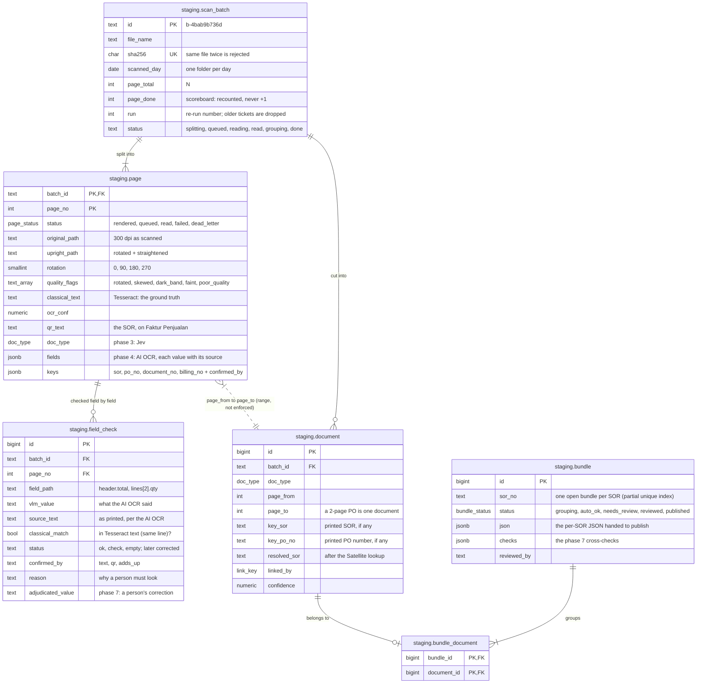
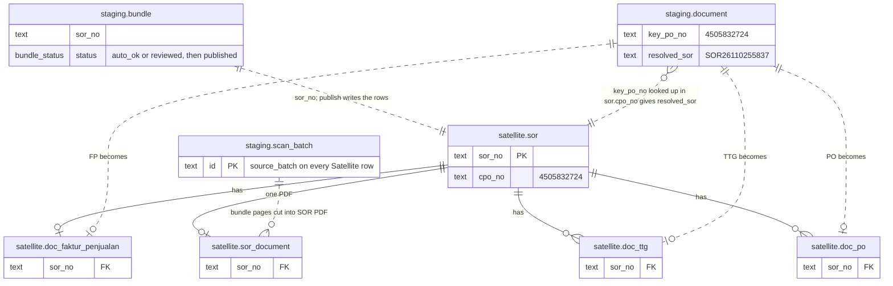

# Database

Two schemas in one Postgres (in production they are two systems):

| Schema | What it is | Who writes it | Who reads it |
|---|---|---|---|
| **`staging`** | The pipeline's memory: every scan, every page, every reading, every guess | the OCR workers (phases 1–7) | the inspection UI, the grouper, the publisher |
| **`satellite`** | The clean record in front of SAP: one row per document, each tied to one SOR, plus one PDF per SOR | only the **publisher** (phase 8) | Fakturis, Pelunasan, SAP |

Read the diagrams like this:

- **Solid line** = a foreign key. Postgres enforces it: you cannot insert a row pointing at something that doesn't exist.
- **Dashed line** = a *logical* link. The pipeline matches values (a PO number, an SOR string), but no foreign key stops a bad value. These are the links the checks in phase 7 exist to protect.
- `||` exactly one · `o|` zero or one · `o{` zero or more · `|{` one or more.

Source: live database (`docker compose exec postgres psql -U ocr -d ocr`), schema files `schema/*.sql`. Rendered images are in [`docs/img/`](img/) if your editor doesn't render Mermaid.

---

## 1. Satellite — one SOR, many documents

Everything hangs off **`sor`**. Each customer document becomes one row in the table for its type, and every one of those rows has a foreign key to exactly one SOR. A customer whose SOR has only an FP and a TTG simply has no rows in `doc_po` or `doc_surat_jalan` for it — that's the "full set or subset" rule.

```mermaid
erDiagram
    customer_profile ||--o{ product_code_map : "maps item codes for"
    customer_profile ||..o{ sor : "customer_code (not enforced)"

    sor ||--o| doc_faktur_penjualan : "has at most one"
    sor ||--o{ doc_ttg : "has"
    sor ||--o{ doc_po : "has"
    sor ||--o{ doc_surat_jalan : "has"
    sor ||--o| sor_document : "one bundled PDF"
    sor |o--o{ doc_faktur_pajak : "linked by Billing No (next stage)"
    sor |o--o{ doc_pelunasan_line : "traced from Ref No (later stage)"

    doc_faktur_penjualan ||--|{ doc_faktur_penjualan_line : "contains"
    doc_ttg ||--o{ doc_ttg_line : "contains"
    doc_po ||--o{ doc_po_line : "contains"

    product_code_map }o..o{ doc_ttg_line : "item_code to kode_material"
    product_code_map }o..o{ doc_po_line : "product_code to kode_material"

    sor["satellite.sor"] {
        text sor_no PK "SOR26110255837"
        text customer_code "already exists in Satellite"
        text cpo_no "customer PO the SO came from"
        date tgl_so
        numeric total
    }
    sor_document["satellite.sor_document"] {
        text sor_no PK, FK
        text pdf_path "documents/SOR....pdf"
        int page_count
        int version "bumps when Faktur Pajak is appended"
        text source_batch "staging.scan_batch.id"
    }
    customer_profile["satellite.customer_profile"] {
        text customer_code PK
        text customer_name
        jsonb doc_aliases "TTG = Receiving Slip / GRN / Good Receipt"
        doc_type_array expected_docs "full set or subset"
        link_key link_key "sor or po_no"
    }
    product_code_map["satellite.product_code_map"] {
        text customer_code PK, FK
        text customer_item_code PK "K6N302030561"
        text customer_barcode
        text samb_material_code "FP Kode: 1000566"
    }
    doc_faktur_penjualan["satellite.doc_faktur_penjualan"] {
        bigint id PK
        text sor_no FK, UK "one FP per SOR"
        numeric dpp "§6.1: Dasar Pengenaan Pajak"
        numeric ppn "§6.1: PPN"
        numeric total "§6.1: Total"
        text nomor_cpo "linking: Nomor CPO"
        text customer_name "linking: Kepada"
        text customer_code "linking: Customer code"
        int_array page_ref
        link_key linked_by
        numeric confidence
    }
    doc_faktur_penjualan_line["satellite.doc_faktur_penjualan_line"] {
        bigint doc_id PK, FK
        smallint line_no PK
        text kode_material "§6.1: Kode material (field 'Kode')"
        text nama_produk "§6.1: Nama produk"
        text kemasan "§6.1: Kemasan"
        numeric qty_crt "§6.1: Qty (CRT)"
        numeric qty_pcs "§6.1: Qty (PCS)"
    }
    doc_ttg["satellite.doc_ttg"] {
        bigint id PK
        text sor_no FK
        date posting_date "§6.1: Posting date"
        text document_no "§6.1: Document No"
        text purchase_order_no "§6.1: Purchase Order No"
        text vendor_number "§6.1: Vendor Number"
        text no_ref "linking: No Ref"
        text customer_name "linking: Customer"
        int_array page_ref
        link_key linked_by
        numeric confidence
    }
    doc_ttg_line["satellite.doc_ttg_line"] {
        bigint doc_id PK, FK
        smallint line_no PK
        text item_code "§6.1: Item code"
        text material_description "§6.1: Material description"
        numeric qty "§6.1: Qty"
        text uom "§6.1: UOM"
    }
    doc_po["satellite.doc_po"] {
        bigint id PK
        text sor_no FK
        text purchase_order_no "§6.1: Purchase Order No"
        text vendor_code "§6.1: Vendor code"
        text vendor_name "§6.1: Vendor name (nama lengkap SAMB)"
        numeric ppn "§6.1: PPN"
        numeric total "§6.1: Total"
        text customer_name "linking: Customer"
        int_array page_ref
        link_key linked_by
        numeric confidence
    }
    doc_po_line["satellite.doc_po_line"] {
        bigint doc_id PK, FK
        smallint line_no PK
        text product_code "§6.1: Product code"
        text product_description "§6.1: Product description"
        numeric qty "§6.1: Qty"
        text uom "§6.1: UOM"
        numeric unit_price "§6.1: Unit price"
        text discount "§6.1: Discount"
    }
    doc_surat_jalan["satellite.doc_surat_jalan"] {
        bigint id PK
        text sor_no FK
        text no_sj "fields not observed yet"
        date tgl_sj
        link_key linked_by
    }
    doc_faktur_pajak["satellite.doc_faktur_pajak"] {
        bigint id PK
        text sor_no FK "NULL until Billing No resolves"
        text billing_number "§6.1: Billing Number"
        text kode_seri "§6.1: Kode Seri"
        text npwp_pengusaha "§6.1: NPWP pengusaha"
        text nitku_pengusaha "§6.1: NITKU pengusaha"
        text npwp_pembeli "§6.1: NPWP pembeli"
        text nitku_pembeli "§6.1: NITKU pembeli"
        numeric dpp "§6.1: Dasar Pengenaan Pajak"
        numeric ppn "§6.1: PPN"
        date tanggal_transaksi "§6.1: Tanggal transaksi"
        int_array page_ref
        link_key linked_by
        numeric confidence
    }
    doc_pelunasan_line["satellite.doc_pelunasan_line"] {
        bigint id PK
        text reference_no "GR No, Billing No or PO No"
        text reference_kind
        numeric amount
        date payment_date
        text sor_no FK "NULL until traced"
    }
```

**The columns of every `doc_*` table are generated from the field list** (`services/common/fields.py`, §6.1 + linking fields); see the Field lists screen in the UI.

**Why `doc_faktur_penjualan` is "at most one" but the others are "many":** the Faktur Penjualan is SAMB's own invoice — one per SOR, enforced by a `UNIQUE` on `sor_no`. A customer can return two TTG pages or a multi-page PO for the same SOR.

**Why `doc_faktur_pajak.sor_no` can be empty:** a Faktur Pajak arrives later and only carries a Billing No. It sits unlinked until Billing No → SAP → SOR resolves, then it gets its `sor_no` and is appended to the SOR's PDF.

---

## 2. Staging — from one scan to bundles

This is the pipeline's working area. It keeps everything, including wrong guesses, so any step can be re-run and any decision can be explained.

**Why `document` and `bundle` are separate:** *document* answers "which pages are one piece of paper?" (a 2-page PO). *Bundle* answers "which pieces of paper belong to one SOR?". A TTG scanned next Thursday is a new `document` in a new batch, but it joins the **same** open bundle for its SOR — which is why a bundle is not tied to a batch.

---

## 3. The bridge — how staging becomes Satellite

Nothing in staging has a foreign key into Satellite: in production they are different systems. Every arrow here is a **lookup or a copy** done by code, which is why all of them are dashed.

---

## Worked example — the Boots SOR from the sample scan

Pages 3, 4, 5 of `7000356304 - 7000356499.pdf`. What each table will hold once phases 3–8 have run (today only `scan_batch` and `page` are filled):

| Table | Rows for this SOR | Key values |
|---|---|---|
| `staging.scan_batch` | 1 (shared with the other 287 pages) | `b-4bab9b736d`, `page_total 288` |
| `staging.page` | 3 | p3 `qr_text = SOR26110255837` · p4 PO · p5 TTG |
| `staging.document` | 3 | FP `key_sor=SOR26110255837` · PO `key_po_no=4505832724` · TTG `key_po_no=4505832724` |
| `staging.bundle` | 1 | `sor_no SOR26110255837`, 3 documents via `bundle_document` |
| `satellite.sor` | 1 (already exists in Satellite) | `cpo_no 4505832724` ← how the PO and TTG found it |
| `satellite.doc_faktur_penjualan` | 1 | total 1,126,011 · `linked_by sor` |
| `satellite.doc_po` | 1 | PO 4505832724 · total 1,126,006 · `linked_by po_no` |
| `satellite.doc_ttg` | 1 | `customer_doc_name "Good Receipt"` · GR 5043773365 · `linked_by po_no` |
| `satellite.doc_*_line` | 6 per document | the six Vaseline items |
| `satellite.sor_document` | 1 | `SOR26110255837.pdf`, 3 pages, version 1 |
| `satellite.doc_faktur_pajak` | 0 → 1 later | appended by Billing No; `sor_document.version` → 2 |

Hari Hari's SORs differ in one place: their Receiving Slip prints the SOR as `No Ref`, so the TTG gets `linked_by = sor` directly instead of going through `cpo_no`.

---

## Vocabulary (Postgres enums)

| Type | Values |
|---|---|
| `doc_type` | `FP` Faktur Penjualan · `TTG` Tanda Terima (any customer's name for it) · `SJ` Surat Jalan · `PO` · `FPJ` Faktur Pajak · `PEL` Pelunasan · `CONTINUATION` page 2+ of a document · `OTHER` |
| `link_key` | `sor` · `po_no` · `billing_no` · `amount` · `adjacency` — strongest to weakest evidence that a document belongs to its SOR |
| `page_status` | `rendered` · `queued` · `read` · `failed` · `dead_letter` |
| `bundle_status` | `grouping` · `auto_ok` · `needs_review` · `reviewed` · `published` |

## Links the database does not enforce

These are the dashed lines. Each has a check (existing or planned) instead of a foreign key.

| From | To | Why not a foreign key | Protected by |
|---|---|---|---|
| `staging.document.key_po_no` | `satellite.sor.cpo_no` | different systems; OCR may misread | Satellite lookup must return exactly one SOR (phase 6) |
| `staging.bundle.sor_no` | `satellite.sor.sor_no` | different systems | "SOR exists in Satellite" check (phase 7) |
| `satellite.sor.customer_code` | `satellite.customer_profile` | `sor` is an existing Satellite table we don't own | profile defaults when missing |
| `satellite.doc_*_line` item codes | `satellite.product_code_map` | mapping table may not exist yet (Problem Statement §07) | line-item cross-check reports "unmapped" (phase 7) |
| `satellite.*.source_batch` | `staging.scan_batch.id` | provenance only | — |
